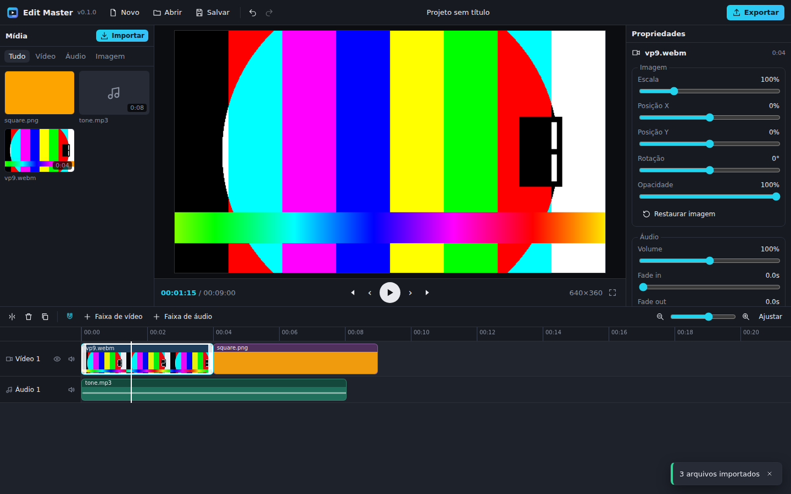

# Edit Master

Editor de vídeo **gratuito**, **offline** e **sem nuvem**, inspirado no CapCut.
Funciona como **app instalável no Windows** (com atualização automática pelo GitHub) e também direto no **navegador**.
Seus arquivos nunca saem do seu computador.



## O que já funciona

- Importar vídeo, áudio e imagem (arrastar e soltar ou botão Importar) — MP4, MOV, WebM, MKV, MP3, WAV, M4A, OGG, FLAC, PNG, JPG, WebP
- Biblioteca de mídia com miniaturas
- Timeline com várias faixas de vídeo e áudio: mover, aparar (bordas), dividir, duplicar, apagar, apagar fechando o espaço
- Ímã (snap) nas bordas dos clipes e no cursor, zoom (Ctrl+roda), filmstrip e forma de onda
- Preview em tempo real sincronizado, quadro a quadro, tela cheia
- Propriedades do clipe: escala, posição, rotação, opacidade, volume (até 200%), fade in/out
- Formatos de projeto: 16:9, 9:16 (TikTok/Reels), 1:1, 4:5, 4:3, 21:9 — ou o tamanho do primeiro vídeo
- Desfazer/refazer ilimitado (cada arraste conta como um passo)
- Salvamento automático local + recuperação após fechar/travar; salvar/abrir projeto `.emproj`
- Exportação MP4 (H.264 + AAC no Windows) de 480p a 4K, 24–60 fps, processada 100% no seu PC
- App Windows com atualização automática

**Fase 2**
- **Textos**: fonte, tamanho, cor, negrito/itálico, alinhamento, contorno, sombra, fundo, 6 estilos prontos
- **Animações de texto** de entrada e saída: aparecer, subir, descer, pop, máquina de escrever, desfoque
- **Filtros** (P&B, Sépia, Vintage, Quente, Frio, Vívido, Desbotado, Dramático) e **ajustes de cor**:
  brilho, contraste, saturação, temperatura, matiz, desfoque e vinheta
- **Transições** entre clipes: dissolver, escurecer, deslizar, cortina, zoom, círculo (duração ajustável)
- **Keyframes** de escala, posição, rotação e opacidade (botão ◆), com navegação entre keyframes
- **Velocidade** de 0,25x a 4x (os clipes seguintes se ajustam sozinhos)
- **Separar áudio** do vídeo para uma faixa de áudio

### Atalhos

| Tecla | Ação |
|---|---|
| `Espaço` | Reproduzir / pausar |
| `S` ou `Ctrl+B` | Dividir no cursor |
| `T` | Novo texto no cursor |
| `Del` / `Shift+Del` | Apagar / apagar e fechar o espaço |
| `Ctrl+Z` / `Ctrl+Shift+Z` | Desfazer / refazer |
| `Ctrl+D` | Duplicar |
| `←` `→` (`Shift` = 1s) | Quadro a quadro |
| `Ctrl+S` / `Ctrl+O` / `Ctrl+E` / `Ctrl+I` | Salvar / abrir / exportar / importar |
| `+` `-` / `Ctrl+roda` | Zoom da timeline |
| `N` | Liga/desliga o ímã |

## Instalar no Windows

1. Abra a página [Releases](https://github.com/gidadesivos/edit-master/releases/latest).
2. Baixe `Edit Master_x.x.x_x64-setup.exe` e execute (não precisa de administrador).
3. Pronto. Quando sair uma versão nova, o app mostra **"Nova versão disponível → Atualizar e reiniciar"**. Não é preciso reinstalar.

> O Windows pode mostrar o aviso do SmartScreen na primeira instalação ("Editor desconhecido") porque o instalador ainda
> não tem certificado de assinatura de código. Clique em **Mais informações → Executar assim mesmo**. Isso não afeta as atualizações.

## Configuração única do repositório (dono do projeto)

Faça isto **uma vez** para as atualizações automáticas funcionarem:

1. **Chave de assinatura das atualizações**: em *Settings → Secrets and variables → Actions → New repository secret*, crie
   `TAURI_SIGNING_PRIVATE_KEY` com o conteúdo do arquivo `edit-master-updater.key` (a chave privada correspondente à
   `pubkey` em `src-tauri/tauri.conf.json`). Guarde esse arquivo em local seguro e **nunca** o coloque no repositório:
   se ele for perdido, os apps já instalados deixam de conseguir se atualizar.
   - Para gerar um par novo: `npx tauri signer generate -w edit-master-updater.key`, então cole o conteúdo do `.pub`
     em `plugins.updater.pubkey` no `tauri.conf.json` (e salve a senha, se usar, no secret `TAURI_SIGNING_PRIVATE_KEY_PASSWORD`).
2. **Versão web (opcional)**: *Settings → Pages → Source: GitHub Actions*. A cada push na `main` o editor é publicado em
   `https://gidadesivos.github.io/edit-master/`.
3. Os Releases precisam ser **públicos** (o repositório público resolve isso).

## Publicar uma nova versão

```bash
npm run release -- 0.2.0 --push
```

Isso atualiza a versão nos arquivos, cria o commit e a tag `v0.2.0` e envia. O workflow **Release** compila o instalador
no Windows, publica no GitHub Releases junto com o `latest.json`, e todos os apps instalados recebem a atualização.
Também dá para rodar o workflow manualmente na aba *Actions* (ele usa a versão do `package.json`).

## Desenvolvimento

Requisitos: Node 22+, e para o app desktop o [Rust](https://rustup.rs) (no Windows, o WebView2 já vem com o sistema).

```bash
npm install
npm run dev            # editor no navegador em http://localhost:5173
npm test               # testes unitários (motor de edição)
npm run test:e2e       # teste ponta a ponta no Chromium (precisa de ffmpeg)
npm run desktop:dev    # app desktop em modo desenvolvimento
npm run desktop:build  # gera o instalador local
```

### Arquitetura

| Pasta | Conteúdo |
|---|---|
| `src/engine` | Modelo do projeto e operações puras (mover, aparar, dividir…), histórico, serialização — 100% testado |
| `src/media` | Importação e leitura de mídia local (Mediabunny/WebCodecs), miniaturas, forma de onda, IndexedDB |
| `src/render` | Compositor compartilhado, preview em tempo real e exportação MP4 |
| `src/ui` | Interface React |
| `src/platform` | Acesso a arquivos e atualizador |
| `src-tauri` | App Windows (Tauri 2 + plugin de atualização) |

O preview e a exportação usam o **mesmo compositor**, então o que aparece na tela é o que sai no arquivo.

## Próximas fases

- **Fase 2 (restante)**: reverso, curvas de velocidade, mais fontes embutidas, máscaras
- **Fase 3**: legendas automáticas (Whisper local), remover fundo, chroma key, proxies para 4K
- **Fase 4**: modo offline completo da versão web (PWA), idiomas, mais formatos de exportação
